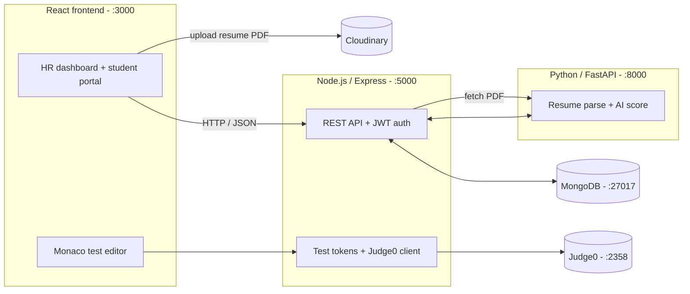

# TalentForge — Automated Recruitment System

A hiring pipeline that ties job posting, AI resume screening, and live coding tests into one flow. Built with React, Node.js, MongoDB, and a Python service for resume scoring.

Live demo: [YouTube](https://youtu.be/oFAwrTyHF_4)

---

## What it does

Recruiters post a job, candidates apply with a PDF resume, and the system scores every resume against the job description, ranks the shortlist, and runs timed coding tests — no manual CV sorting.

The pipeline:

1. HR posts a job with required skills and description
2. Students apply by uploading their resume
3. AI scores each resume (keyword match + semantic similarity)
4. HR shortlists from the ranked list
5. Shortlisted students take a timed coding test
6. HR reviews final rankings and advances the best candidates

## Architecture

Four pieces talk to each other over HTTP: a React client, the Express API, the Python scoring service, and a code-execution engine.



## Tech stack

| Layer | What's used |
|---|---|
| Frontend | React, Tailwind CSS, Material UI, Monaco Editor, Axios |
| Backend | Node.js, Express, MongoDB, Mongoose, JWT, bcrypt |
| AI service | Python, FastAPI, SentenceTransformers (MiniLM), scikit-learn, pdfplumber |
| Code execution | Judge0 (self-hosted) or the included Python stub |
| Storage | Cloudinary (resume PDFs) |

## How resume scoring works

1. The resume PDF is stored on Cloudinary and its URL is saved on the application
2. When HR triggers screening, the backend sends the PDF and the job description to the AI service
3. `pdfplumber` extracts the text
4. Two scores are computed, each 0–100:
   - **Keyword score** — the share of job-description terms that appear in the resume
   - **Semantic score** — cosine similarity of MiniLM sentence embeddings of the resume vs. the job description
5. The two are averaged (50/50) into the final score

```json
{
  "final_score": 87.45,
  "keyword_score": 82.33,
  "semantic_score": 92.57,
  "missing_keywords": ["react", "mongodb"]
}
```

The hybrid keyword-plus-semantic approach follows how production staffing systems match job seekers to vacancies — see the [reference](#reference) below.

## Project layout

```
Backend/                 Express API
├── src/
│   ├── controllers/     route handlers (auth, job, test, ...)
│   ├── models/          Mongoose schemas
│   ├── routes/          REST routes
│   ├── services/        Judge0 client
│   └── config/          DB connection, mailer, env
├── scripts/             judge0_stub.py (offline code runner)
└── tests/               Jest integration tests

frontend/                React app
├── src/
│   ├── pages/           HR, student, auth pages
│   ├── components/      shared UI
│   ├── context/         auth state
│   └── apiConfig.js     API base URL

services/                FastAPI microservice
├── src/
│   ├── api/routes.py    POST /resume/score
│   ├── controllers/     resume_controller.py
│   └── main.py          app entry
└── requirements.txt
```

## Getting started

Requirements: Node 18+, Python 3.10+, Docker.

```bash
# 1. MongoDB
docker run -d --name talentforge-mongo -p 27017:27017 mongo:6

# 2. Backend
cd Backend
npm install
npm run dev

# 3. AI scoring service
cd ../services
pip install -r requirements.txt
python -m uvicorn src.main:app --host 127.0.0.1 --port 8000

# 4. Frontend
cd ../frontend
npm install
npm start
```

The app opens at `http://localhost:3000`. For the coding round, either run the included Judge0 stub (`python Backend/scripts/judge0_stub.py`) or point `JUDGE0_URL` at a self-hosted Judge0 instance.

### Environment

`Backend/.env`:

```env
PORT=5000
MONGO_URI=mongodb://localhost:27017/talentforge
JWT_SECRET=...
TEST_SECRET=...
FRONTEND_URL=http://localhost:3000
APP_BASE_URL=http://localhost:3000
CLOUDINARY_CLOUD_NAME=...
CLOUDINARY_API_KEY=...
CLOUDINARY_API_SECRET=...
JUDGE0_URL=http://localhost:2358
ML_API_URL=http://localhost:8000
EMAIL_USER=...
EMAIL_PASS=...
```

`frontend/.env`:

```env
REACT_APP_API_URL=http://localhost:5000
```

## Reference

Lavi, D., Medentsiy, V., & Graus, D. (2021). *conSultantBERT: Fine-tuned Siamese Sentence-BERT for Matching Jobs and Job Seekers*. RecSys in HR 2021 (workshop at ACM RecSys). arXiv:2109.06501. doi:10.48550/arXiv.2109.06501

Its core idea drives the scoring model: represent resumes and job descriptions as sentence embeddings, rank by similarity, and keep keyword overlap as a check.

## Author

**Gaurav Yadav** — [github.com/gauravdev95](https://github.com/gauravdev95) · [linkedin.com/in/gauravyadav95](https://www.linkedin.com/in/gauravyadav95/)